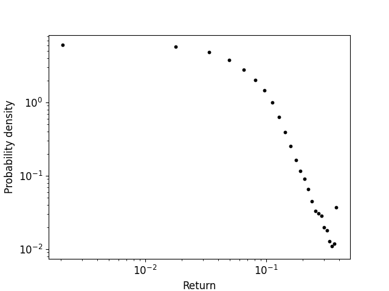
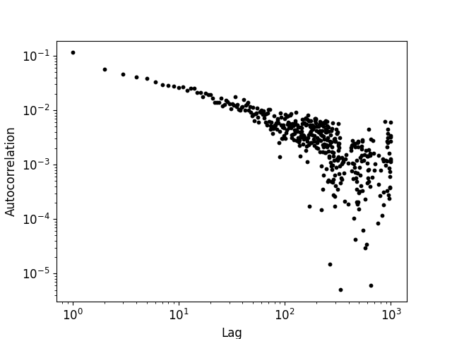
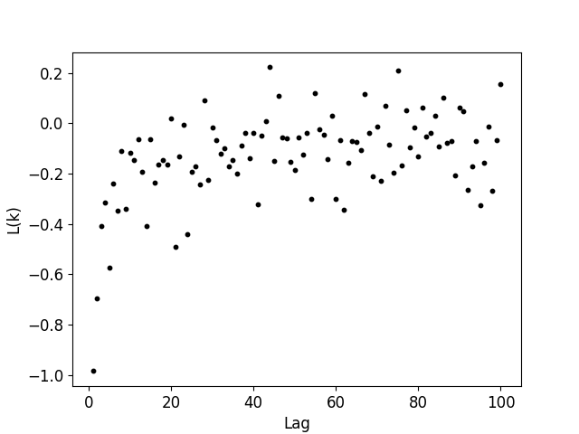
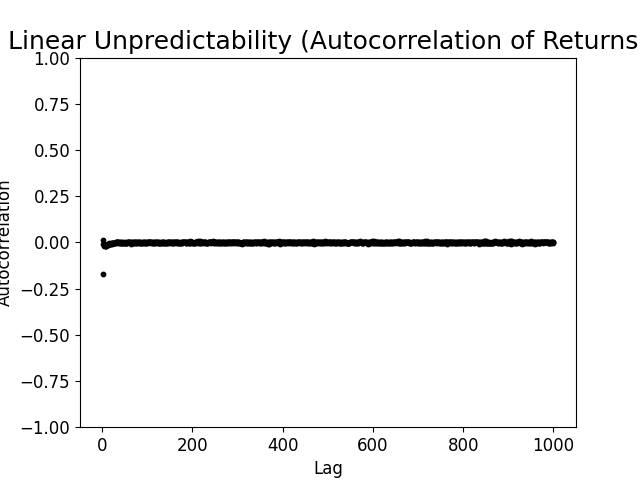
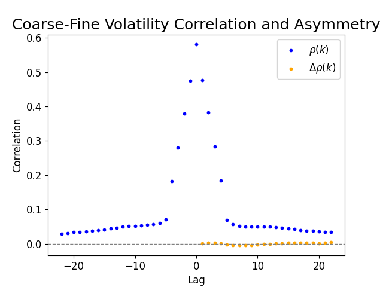
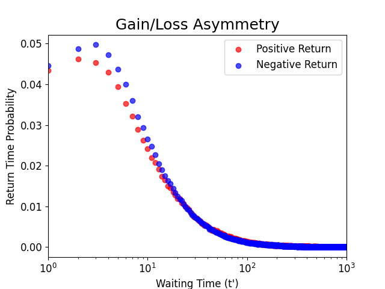

# GBM — Score-Based Diffusion for Synthetic Financial Time Series

PyTorch implementation of:

> **A diffusion-based generative model for financial time series via geometric Brownian motion**
> Gihun Kim, Sun-Yong Choi, Yeoneung Kim — [arXiv:2507.19003](https://arxiv.org/abs/2507.19003) (July 2025).

The paper proposes injecting Gaussian noise in **log-price space** (equivalent to Geometric Brownian Motion in price space) so that the forward diffusion inherits the multiplicative, heteroskedastic structure of real asset prices. With drift balanced as `μ_t = ½σ_t²`, the log-price process reduces to a Variance-Exploding (VE) SDE — so the standard score-matching machinery applies, but the implied price-space dynamics now match GBM. Generated samples reproduce heavy tails, volatility clustering, and the leverage effect more faithfully than additive-noise diffusion baselines or GAN models. The score network is a CSDI-style Transformer.

In this codebase the GBM regime is **`--alpha 1`**, training on log-prices (`data/sp500_subseq_log.pt`, model dir `save_model_bs_*`). `--alpha 0` runs the additive VE/VP baselines on log-returns. See the [paper](https://arxiv.org/abs/2507.19003) for the full derivation and reported tail-exponent results.

If you just want to run something end-to-end, jump to [`QUICKSTART.md`](QUICKSTART.md). For deeper treatment of any subsystem, see the [`docs/`](docs/README.md) folder: data pipeline, architecture, SDEs & schedules, training, sampling, stylized-fact evaluation, and paper context.

---

## Pipeline

```
data_download.py      →   train.py      →   generate.py / plot_result.py
(fetch & preprocess)      (1 or N GPUs)    (reverse-diffusion sampling)
                                              ↓
                                          csv_to_plot_result.py / arrow_plot.py
                                          ori_plot_result.py  (real-data baseline)
```

1. **Download & preprocess** S&P 500 OHLCV via `yfinance`, cut into sliding windows, fit a global `StandardScaler`, and save `.pt` shards.
2. **Train** `diff_CSDI` with denoising score matching over a VP or VE SDE and a cosine / linear / exponential noise schedule. Single-GPU by default; multi-GPU via `torchrun --nproc_per_node=N` (auto-detected by the script).
3. **Generate** new trajectories with a Song et al. predictor–corrector sampler.
4. **Evaluate** by computing stylized-fact metrics on generated vs. real data and plotting side-by-side.

---

## Files

| File | Role |
|------|------|
| `run_experiment.sh` / `run_experiment.ps1` | End-to-end driver: data prep → train → sample → stylized-fact plots → real-data baseline. Pick experiment with `TARGET=gbm/vp/ve`; idempotent (skips data prep if `data/` populated, auto-resumes training). Recommended entry point for reproduction. PowerShell variant for Windows / cross-platform `pwsh`. |
| `data_download.py` | Fetches S&P 500 tickers from Wikipedia, downloads history via `yfinance`, extracts sliding windows (length 2048, stride 400) of log-returns and log-prices, fits a global `StandardScaler`, writes `sp500_subseq.pt` (returns), `sp500_subseq_log.pt` (log-prices), `sp500_subseq_original.pt` (raw + scalers). |
| `model_config.py` | Canonical `MODEL_CONFIG` dict imported by `train.py`, `generate.py`, and `plot_result.py` so a checkpoint trained under one is loadable by the others. |
| `networks.py` | Model architecture. `diff_CSDI` = input Conv1d → stack of `ResidualBlock`s (time-attention + feature-attention, gated `σ(gate) ⊙ tanh(filter)`, skip/residual) → two output Conv1d layers. `DiffusionEmbedding` provides sinusoidal + MLP embedding of the diffusion time `t`. Optional efficient attention via `linear_attention_transformer` (lazy-imported, only required when `is_linear=True`). |
| `losses.py` | `denoising_score_matching_loss` for both VE (`x(t) = x + σ(t)·ε`) and VP (`x(t) = γ(t)·x + σ(t)·ε`) SDEs; variance-weighted. |
| `utils.py` | Noise-schedule primitives `sigma_t` and the closed-form `var_integral` for exponential/linear/cosine schedules; `time_embedding`, `get_side_info`, `set_input_to_diffmodel`. |
| `train.py` | Main training entry point. `PreprocessedFinancialDataset` loads the `.pt` shard; auto-detects single-GPU vs DDP from `torchrun` env vars; SIGINT is handled cleanly; per-epoch checkpoint to `--model_dir` (only the latest is kept). |
| `generate.py` | Loads a checkpoint and samples with `predictor_corrector_sampling` (reverse Euler predictor + Langevin corrector). `sample_init_bs` draws the α=1 GBM-prior initial state. Writes `{denoised, labels}` to `.pt`. |
| `plot_result.py` | End-to-end: sample → (if α=1, inverse-scale & differentiate to returns) → dump per-sample CSVs → compute stylized-fact metrics → render 6-panel plots; fits a power-law tail with the `powerlaw` library. |
| `csv_to_plot_result.py` | Re-runs metrics + plots from previously dumped CSVs (skips resampling). |
| `ori_plot_result.py` | Same metrics/plots on the **real** S&P 500 data — the baseline for comparison. |
| `arrow_plot.py` | Publication-style price plots with a ±width envelope and arrows annotating local extrema scaled by local volatility. |

---

## Quick Start

The driver script handles data prep, training, sampling, plotting, and the real-data baseline in one command. Pick an experiment with the `TARGET` env var.

```bash
# Paper headline (GBM forward process, exponential schedule — closest heavy-tail fit)
./run_experiment.sh

# Additive-noise baselines
TARGET=ve ./run_experiment.sh
TARGET=vp ./run_experiment.sh

# First-class flags (others remain env-var only)
./run_experiment.sh -e 2                  # epochs
./run_experiment.sh -b 16                 # batch size (lower if VRAM-tight)
./run_experiment.sh -g 4                  # multi-GPU DDP via torchrun (4 GPUs)
./run_experiment.sh -e 200 --batch_size 32 --gpus 2

# Quick smoke (verify the pipeline in ~minutes, not hours)
./run_experiment.sh -e 2 -b 16
EPOCHS=2 BATCH_SIZE=16 STEPS=100 NUM_SAMPLES=5 ./run_experiment.sh
```

PowerShell (Windows or `pwsh` on any platform) — same script, different syntax:

```powershell
./run_experiment.ps1                                # default = TARGET=gbm
./run_experiment.ps1 -Target ve
./run_experiment.ps1 -Target gbm -Schedule exponential
./run_experiment.ps1 -Epochs 2 -BatchSize 16 -Steps 100 -NumSamples 5
```

The script:
- skips data prep if `data/sp500_subseq*.pt` already exist;
- runs `train.py` (auto-resumes from the highest-numbered checkpoint);
- selects the latest checkpoint and runs `plot_result.py` against it;
- writes the real-data baseline plots to `ori_plot/` (skipped if non-empty).

Override any individual knob via env var (`BATCH_SIZE`, `EPOCHS`, `LR`, `SCHEDULE`, `NUM_SAMPLES`, `STEPS`, `SNR`, `N_CORR`, `SIGMA_MIN`, `SIGMA_MAX`, `CUDA_VISIBLE_DEVICES`). See [`QUICKSTART.md`](QUICKSTART.md) for details and per-step manual commands if you'd rather invoke `train.py` / `plot_result.py` directly.

---

## Results — GBM forward process, exponential schedule

Stylized-fact plots produced by `./run_experiment.sh` (default `TARGET=gbm`, `SCHEDULE=exponential`) — the paper's best heavy-tail match. Each panel averages a metric across the generated synthetic sequences; compare visually against the real-data baseline in `ori_plot/`.

| | | |
|:--:|:--:|:--:|
|  |  |  |
| **Heavy-tailed distribution**<br/>log–log marginal PDF; paper reports α ≈ 4.62 for GBM-exponential vs. empirical α ≈ 4.35 | **Volatility clustering**<br/>ACF of \|returns\|; slow power-law decay is the target | **Leverage effect**<br/>negative cross-correlation `corr(r_t, r²_{t+k})` for small lags |
|  |  |  |
| **Linear unpredictability**<br/>ACF of returns; should sit near zero at all lags | **Coarse–fine asymmetry**<br/>ρ(k) and Δρ(k) for τ=5; positive Δρ on positive lags | **Gain/loss asymmetry**<br/>waiting-time distributions to ±0.1 cumulative return |

---

## Design Choices

**α switch — selects the SDE family.** `α = 0` is the additive-noise baseline (VE / VP on log-returns). **`α = 1` is the paper's GBM regime** — Gaussian noise is injected in log-price space, which (with `μ_t = ½σ_t²`) reduces to a VE SDE in log-coordinates while implying GBM dynamics in price space. Each mode uses a different input `.pt` and scaler. See [`docs/sde-and-schedules.md`](docs/sde-and-schedules.md).

**SDE family.** `--sde VP` (variance-preserving, bounded marginal) and `--sde VE` (variance-exploding) implemented in `losses.py`/`generate.py`. The paper finds **GBM (`α=1`) with cosine or exponential schedules** wins on all three stylized facts; pure VE/VP on log-returns produces light tails.

**Noise schedules.** `exponential`, `linear`, and `cosine`; each has a closed-form `var_integral` in `utils.py` used for loss weighting.

**Sampler.** Predictor–corrector with `--steps` reverse-diffusion steps and `--n_corr` Langevin corrections per step at signal-to-noise ratio `--snr`.

**Evaluation.** Rather than MSE, the model is judged on financial realism. `plot_result.py` computes:
1. Linear unpredictability (ACF of returns)
2. Heavy-tailed return distribution (log–log) with `powerlaw` MLE fit — empirical S&P 500 baseline `α ≈ 4.35`
3. Volatility clustering (ACF of |returns|)
4. Leverage effect `L(k)`
5. Coarse–fine volatility correlation and its asymmetry
6. Gain/loss waiting-time distributions

Per-(SDE, schedule) tail exponents reported by the paper (§4) are useful sanity checks when comparing your runs — see [arXiv:2507.19003](https://arxiv.org/abs/2507.19003).

---

## Key Hyperparameters

| Group | Arg | Default |
|-------|-----|---------|
| Data | `target_length`, `stride` | 2048, 400 |
| Training | `--batch_size`, `--epochs`, `--lr` | 64, 1000, 1e-4 |
| SDE | `--sde`, `--alpha`, `--sigma_min`, `--sigma_max` | VP, 0, 0.01, 1.0 |
| Schedule | `--noise_schedule` | cosine |
| Embedding | `--emb_time_dim` | 128 |
| Sampler | `--steps`, `--snr`, `--n_corr` | 1000, 0.2, 1 |

Auto-selected paths inside the scripts depending on `(α, sde)`:

| α | SDE | model dir | data file |
|---|-----|-----------|-----------|
| 1 | VE | `save_model_bs_cosine_64` | `sp500_subseq_log.pt` |
| 0 | VE | `save_model_ve_exponential_64` | `sp500_subseq.pt` |
| 0 | VP | `save_model_vp_cosine_64` | `sp500_subseq.pt` |

---

## Dependencies

`torch`, `numpy`, `pandas`, `scikit-learn`, `matplotlib`, `tqdm`, `joblib`, `yfinance`, `powerlaw`, `lxml`, `requests`, `certifi`, and optionally `linear_attention_transformer` for the efficient attention variant in `networks.py`.

---

## Data Schemas

Preprocessed `.pt` shard:
```python
{
  "data":       [Tensor(2048,)] * N,   # standardized log-returns or log-prices
  "timepoints": [Tensor(2048,)] * N,   # normalized to [0, 1]
  "meta":       [(ticker: str, start_date)] * N,
}
```

Generated `.pt`:
```python
{"denoised": Tensor(N, 2048), "labels": Tensor(N,)}
```

Per-sample CSV (from `plot_result.py`): a single `return` or `log_return` column.

---

## Citation

```bibtex
@article{kim2025gbm,
  title  = {A diffusion-based generative model for financial time series via geometric Brownian motion},
  author = {Kim, Gihun and Choi, Sun-Yong and Kim, Yeoneung},
  journal= {arXiv preprint arXiv:2507.19003},
  year   = {2025},
}
```
